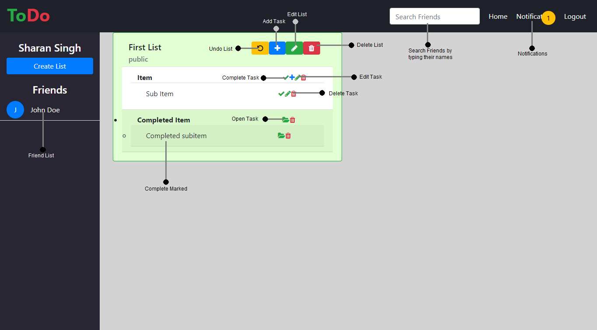

# Todo List Manager - Project Description

URL: http://todo.sharansingh.xyz

API Documentation: http://todo.sharansingh.xyz/apidoc

Socket.IO Events Documentation: http://todo.sharansingh.xyz/eventdoc

### Usage

#### User Management

- To access the app, you need to have an account.
  - **Sign Up**
    - If you don't have an account, create an account, by clicking the "Sign Up".
    - Once you are in the Sign Up page fill the sign up form and submit it.
    - You will receive a mail with an activation link. You click that link, your account will be activated and you will be able to access the account.
  - **Login**
    - If you already have an account, fill the login form at the home page and click the "Login" button
    - Once logged in, you will be taken to the list management page.
    - If you forgot your password, there is a link in the login form to go to the "Forgot Password" page.
    - In the "Forgot Password" page, submit your email. A password reset link will be sent to your email. You need to go that link to create new password. Then login.
  - **Errors**
    - If there are any errors while submitting any form, you get an error in the form of an alert box at the bottom right corner of the page.
- Once you are logged in, you will be taken to a page that looks like the screenshot given above.
- You can make friends with other user by searching for them using the search box at the top of the page in the header section.
  - Enter the name of the user in the search box and all the users having same first name or last name or full name will appear automatically.
  - List of all the users that matches the searched term will be shown.
  - You can click the user to go to their profile page.
  - You can also click the "Add friend" icon to send a friend request to that user.
- You can view all your friends from your profile page as shown in the screenshot.
- If any user sends you a friend request, accept your friend request, or reject your friend request, you will be notified.
  - To view the notifications, click the Notification at the top right navigation area of the page.
- You can log out of your account by clicking the log out at the navigation area.

#### List Management

- Once you are logged in, you will be taken to the list management page.
- Here you can create a new list.
  - List can be of two types: Public or Private.
  - **Private List**
    - Private lists can only be viewed and modified by you.
    - No other users will be able to see your private lists.
  - **Public List**
    - Public lists can be viewed by any user using the app.
    - But can only be modified by you or your friends.
    - All the operations mentioned below, can be done by you or your friends on a public list.
- You can add a task to a list by clicking the + icon at the top of the list.
- You can delete, edit or mark a task done on a list.
- You can undo the last operation of a list, by seleting the list and clicking "CTRL + Z" ("CMD + Z" for mac users) or the undo icon at the top of the list.
  - Once you click on a list, that list will be selected.
  - Selected list can be identified by a green background of the list.
- You can add a subtask to a task by clicking the + icon of the task.
- The add, delete or edit icons of a task will be shown only if mouse is over that task.
- While performing an operation if error occurs then an alert box with an error message will be displayed at the bottom right corner of the screen.